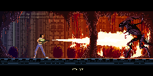
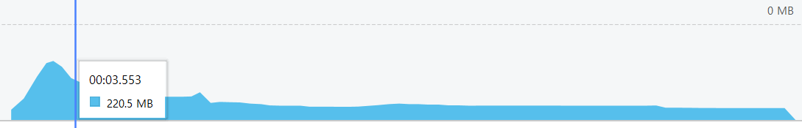
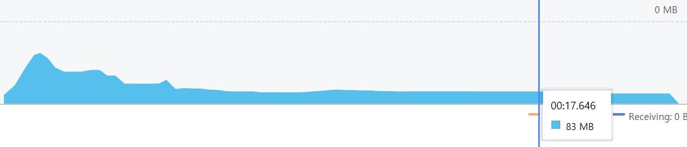

<h1><b>Lost-In-Space</b></h1>
- 2D Horror Survive SideScroller using A* Algorithm -
 
<article>
<b>#Project Member :</b> 1 Developer 
<b>#Language :</b> Java 
<b>#Platform :</b> Android 
<b>#Date :</b> 2019 
</article>
 

<body>
  <h1>요약</h1>
  

    

      A* 알고리즘을 구현을 하며 게임 제작 
    

  

  
  <h1>주요 요소</h1>
  

  
  <h3><b>툴</b></h3>
  <ol>
    <ul>Android Studio</ul>
    <ul>libGDX</ul>
    <ul>Tiled</ul>
  </ol>
   
  <h3><b>씬 리스트</b></h3> 
  <ol>
  <li><b>타이틀 씬</b></li> 
    - 이미지 출력, BGM 루프, 터치 감지 
    
   
              
  <li><b>게임 씬</b></li> 
    - 게임 플레이 씬 
    
   
    
  <li><b>게임 승리/오버</b></li> 
    - 적에게 잡히거나 생존 필수 요소를 찾지 못하면 게임 오버 화면/사운드 출력 
    
     
    - 승리 조건을 만족하면 나오는 화면 
    
   
   
  </ol>
  <h2>짧은 영상</h2>
  - AI이동 영상 
  https://youtu.be/4ufDuvQo19w 
  - 게임 플레이 영상 
  https://youtu.be/_ta-cA5Z6h4 
  

  
  

    <b>게임 설명</b> 
    <ol>
      <li>주어진 시간동안 맵을 돌아다니며 적<에일리언>을 피하고 생존 요소를 모으며 살아 남기</li>
      <li>주어진 시간동안 생존시 승리</li>
      <li>플레이어가 적과 부딛히면 게임 오버</li>
      <li>플레이어는 생존 요소인 <산소>를 수집해야함</li>
      <li><산소>는 시간에 따라 지속적으로 줄어듬
          * 산소가 0이되면 게임 오버
        </li>
      <li>에일리언은 맵을 계속 돌아다님</li>
      <li>에일리언과의 거리에 따라 <레이더> 발동(사운드 및 경고 색상 표현) 
        * 에일리언이 가까울 수록 경고음이 빨리 재생됨
        </li>
    </ol>
  
  

    <ol>
      <li>
        <h4><b>에일리언 패턴</b></h4>
        1. 제자리에서 1~5초 대기 
        2. 특정 위치를 무작위로 선정하여 현재 위치에서 이동 
        3. 어떠한 상태든 플레이어가 인식거리 안에 존재하면 13초 동안 플레이어 위치와 상관없이 추격 
        3-1. 추격 중 플레이어가 인식거리에 또 들어오면 추격시간 13초로 다시 초기화 
        3-2. 추격 후 플레이어가 인식거리 밖에 존재하면 해당 자리에서 1~2과정 반복 
      </li>
      <li>
        <h4><b>알고리즘</b></h4>
        <ol>
        <h5>노드(Node.java)</h5>
          - 각 이동 경로가 되어주는 노드 클래스 
          - 이동 가능 여부를 제공 
          - f, g, h 값 저장 및 초기화 
          - 부모 노드 저장 
          - 주변 노드와 연결시켜 주는 리스트 저장 
           [코드로가기](https://github.com/HoHong123/Lost-In-Space/blob/master/Src/core/src/com/lsgdx/game/Algorithm/Node.java)
        <h5>노드 커넥터(ConnectionNode.java)</h5>
          - 연산이 시작되는 노드와 다음 노드를 연결 시키는 클래스 
          [코드로가기](https://github.com/HoHong123/Lost-In-Space/blob/master/Src/core/src/com/lsgdx/game/Algorithm/ConnectingNode.java)
        <h5>노드 그래프/제너레이터(NodeGraph.java / NodeGraphGenerate.java)</h5>
          - 모든 노드의 정보를 가진 그래프 클래스 
          - 그래프 클래스를 초기화하는 제너레이터 클래스 
          * 그래프는 맵마다 새로 생성되야함(Non-Static 클래스) 
          * 제너레이터는 맵이 바뀌어도 연산처리만 하면됨 (Static클래스) 
          [그래프 코드로가기](https://github.com/HoHong123/Lost-In-Space/blob/master/Src/core/src/com/lsgdx/game/Algorithm/NodeGraph.java) 
          [제너레이터 코드로가기](https://github.com/HoHong123/Lost-In-Space/blob/master/Src/core/src/com/lsgdx/game/Algorithm/NodeGraphGenerate.java)
        <h5>휴리스틱 클래스(HeuristicCalculation.java)</h5>
          - 현재 연산이 필요한 노드위치와 도착점의 거리를 계산하여 휴리스틱 값을 반환하는 클래스 
          [코드로가기](https://github.com/HoHong123/Lost-In-Space/blob/master/Src/core/src/com/lsgdx/game/Algorithm/HeuristicCalculation.java)
        <h5>패스파인딩 클래스(PathFinding.java)</h5>
          - 위 클래스/함수들이 제공하는 값을 활용하여 길을 찾는 클래스 
          - 경로 생성 및 연산 후 남은 객체들 메모리 해제 
          [코드로가기](https://github.com/HoHong123/Lost-In-Space/blob/master/Src/core/src/com/lsgdx/game/Algorithm/PathFinding.java)
        </ol>
         
        <h4><b>에일리언 스크립트</b></h4>
        <ol>
        <h5>기본 정보(Enemy.java)</h5>
          - AI, 스프라이트, 물리 충돌 등 모든 것을 총괄하고 초기화하는 클래스 
          (https://github.com/HoHong123/Lost-In-Space/blob/master/Src/core/src/com/lsgdx/game/Character/Enemy/Enemy.java)
        <h5>AI(EnemyAI.java)</h5>
          - 유한동작기계로 두 AI행동을 번갈아 실행 
          - 플레이어 인식 확인 
          - 스프라이트 변경 조절 
          <h6>1. 이동(EnemyAI_Run.java)</h6> 
          - Pathfinding으로 찾은 경로 리스트를 받아 이동 
          - 플레이어를 인식 후 플레이어 위치를 지속적으로 받아와 매 프레임마다 플레이어 위치로 이동 
          <h6>2. 정지(EnemyAI_Stand.java)</h6> 
          - 특정 시간동안 정지 
          [기본 정보 코드로가기](https://github.com/HoHong123/Lost-In-Space/blob/master/Src/core/src/com/lsgdx/game/Character/Enemy/EnemyAI.java)
          [1. 이동 코드로가기](https://github.com/HoHong123/Lost-In-Space/blob/master/Src/core/src/com/lsgdx/game/Character/Enemy/EnemyAI_Run.java)
          [2. 정지 코드로가기] (https://github.com/HoHong123/Lost-In-Space/blob/master/Src/core/src/com/lsgdx/game/Character/Enemy/EnemyAI_Stand.java)
        <h5>스프라이트(EnemySprite.java)</h5>
          - 스프라이트 시트 정보 추출 및 이미지 리스트 생성 
          - 상황에 따라 특정 애니메이션 실행 
          [코드로가기](https://github.com/HoHong123/Lost-In-Space/blob/master/Src/core/src/com/lsgdx/game/Character/Enemy/EnemySprite.java)
        </ol>
         
        <h4><b>플레이어 스크립트</b></h4>
        <ol>
        <h5>Player.java</h5>
          - 스프라이트 시트 정보 추출 및 애니메이션 설정 
          - 이동 관련 
          - 게임 오버/승리 화면 호출 함수 포함 
          - 물리작용을 위한 콜라이더 설정 
          - 여러 변수 초기화 
          [코드로가기](https://github.com/HoHong123/Lost-In-Space/blob/master/Src/core/src/com/lsgdx/game/Character/Player.java)
        </ol>
      </li>
    </ol>
  

  
  

  <h2>오류 및 시행착오</h2>
  <ol>
    <li>버퍼 오버플로</li>
    - 길 찾기 연산 중 open과 close리스트를 초기화하지 않아 메모리에 지속적으로 새로 생성하여 발생한 오류 
     
    - 모든 알고리즘 및 스크립트에 변수를 사용 후 초기화 하도록 변경 
     
  </ol>
  

</body>
