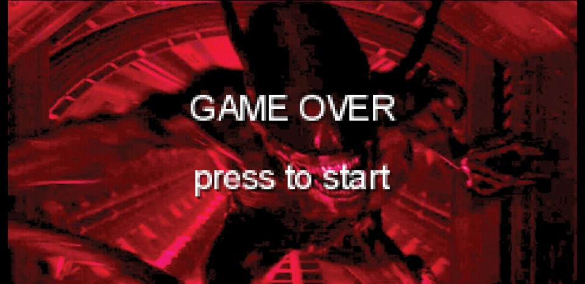

# Lost-In-Space
*****************************************************************************************************<h1>- 2D Horror Survive SideScroller using A* Algorithm -</h1>
<article>
<b>#Project Member :</b> 1 Developer 
<b>#Language :</b> Java 
<b>#Platform :</b> Android 
<b>#Date :</b> 2019 
</article>
 

<body>
  <h1>요약</h1>
  

    

      A* 알고리즘을 구현을 하며 게임 제작 
    

  

  
  <h1>주요 요소</h1>
  

    <ol>
      <li><b>툴</b> 
          <ul>Android Studio</ul>
          <ul>libGDX</ul>
          <ul>Tiled</ul>
      </li>
       
      <li>
          <ul><b>타이틀 씬</b> 
          - 이미지 출력, BGM 루프, 터치 감지 
             
          </ul>
          <ul><b>게임 씬</b> 
          - 게임 플레이 씬 
             
          </ul>
          <ul>
            <b>게임 승리/오버</b> 
            - 적에게 잡히거나 생존 필수 요소를 찾지 못하면 게임 오버 화면/사운드 출력 
            
             
            - 승리 조건을 만족하면 나오는 화면 
            
               
          </ul>
       </li>
        
      <li>
          <ul><b>게임 규칙</b> 
          -  
             
            
          - 게임 플레이 씬 
             
          </ul>
          <ul>Tiled</ul>
        </li>
       
    </ol>
  

  <h2>짧은 작동 영상</h2>
</body>
